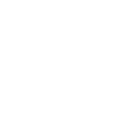
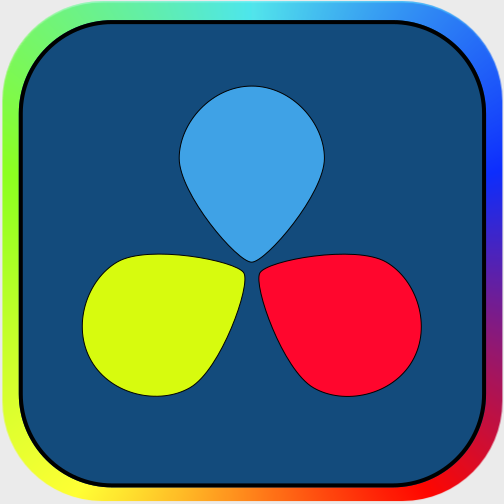

<div style="display: flex; gap: 1rem; align-items: end;">

## Hello, world! 👋 Soy **Fran Aldeguer** &nbsp;&nbsp;&nbsp;&nbsp;|&nbsp;&nbsp;

<!--<a href="https://franaldeguer-cv.netlify.app" alt="CV Fran Aldeguer"></a>-->

<a href="https://linkedin.com/in/franaldeguer" alt="Linkedin Fran Aldeguer"></a>

<a href="https://github.com/FranAldeguer" alt="Linkedin Fran Aldeguer"></a>
</div>

### **Desarrollo software 💻 | Diseño gráfico 👨‍🎨 | Marketing digital 📈**

Desarrollador de aplicaciones web y multiplataforma 👨‍💻. Me encanta todo lo relacionado con la Inteligencia Artificial 🤖 y los sistemas de automatización.

Tengo una gran motivación por el aprendizaje constante y busco siempre nuevas oportunidades para crecer profesionalmente.

Me encanta tomarme un café ☕ hablando de:

🚀 Star Wars  
🤖 Tecnología  
🎮 Videojuegos  
🦸 Cómics  
🎞️ Cine  
📺 Series  
🎲 Juegos de mesa  
🏯 Cultura japonesa 

No dudes en contactarme para charlar de cualquier cosa (incluso hasta para una colaboración) o tomar un café.


### 🛠️ Tecnologías y Habilidades

**Lenguajes de programación:**
<div style="display: flex; gap: 1.5rem">
     
     
     
    
    
     
</div><br>

**Frameworks:**
<div style="display: flex; gap: 1.5rem">
    
    
    
</div><br>

**Herramientas favoritas:**
    <div style="display: flex; gap: 1.5rem">
    
    
    
    
    
    
</div><br>

**Diseño gráfico y edición de vídeo**
<div style="display: flex; gap: 1.5rem">
    
    
    
    
    
    
    
</div><br>


### ¡Gracias por visitar mi perfil! 😊 
Si tienes alguna colaboración en mente, o simplemente quieres charlar sobre tecnología, no dudes en contactarme.


<!-- 
## 🚀 Proyectos Destacados

### [ORM PHP](URL del Proyecto 1)
**Descripción:** Breve explicación del proyecto, su propósito y qué problema resuelve.
**Tecnologías:** [React, Node.js, etc.]

### [Nombre del Proyecto 2](URL del Proyecto 2)
**Descripción:** Breve explicación del proyecto, su propósito y qué problema resuelve.
**Tecnologías:** [HTML, CSS, JavaScript, etc.]

---

## 📝 Artículos y Blogs

- **[Título del artículo 1](URL del artículo)** - Breve descripción del tema tratado.
- **[Título del artículo 2](URL del artículo)** - Breve descripción del tema tratado.

---


## Fran Aldeguer API
<br>

```json
{
  "name": "Fran Aldeguer",
  "role": "Desarrollador Web",
  "soft_skills": [
    "Autodidacta",
    "",
    "CSS",
    "React",
    "Node.js"
  ],
  "interests": ["anime", "cine", "gadgets", "café"],
  "location": "Guardamar del Segura, España",
  "contact": {
    "linkedin": "linkedin.com/in/tu-perfil",
    "github": "github.com/tu-usuario"
  },
  "currently_learning": [
    "Docker",
    "CSS avanzado",
    "Scrum"
  ],
  "favorite_technologies": ["Linux", "Git", "Visual Studio Code"],
  "projects": [
    {
      "name": "Portfolio Personal",
      "description": "Portfolio interactivo en HTML, CSS y JavaScript",
      "url": "https://github.com/tu-usuario/portfolio"
    },
    {
      "name": "Gestor de Tareas",
      "description": "App de tareas usando React y Node.js",
      "url": "https://github.com/tu-usuario/gestor-tareas"
    }
  ]
}
```

-->

<!--
**FranAldeguer/FranAldeguer** is a ✨ _special_ ✨ repository because its `README.md` (this file) appears on your GitHub profile.

Here are some ideas to get you started:

- 🔭 I’m currently working on ...
- 🌱 I’m currently learning ...
- 👯 I’m looking to collaborate on ...
- 🤔 I’m looking for help with ...
- 💬 Ask me about ...
- 📫 How to reach me: ...
- 😄 Pronouns: ...
- ⚡ Fun fact: ...
-->
